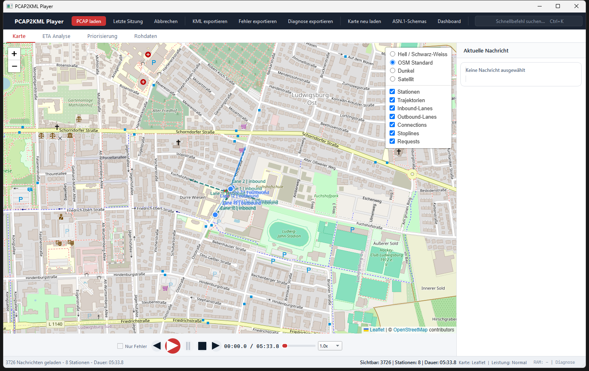

# PCAP2KML Player

Desktop-Anwendung zur Analyse, Wiedergabe und Kartendarstellung von V2X-Nachrichten aus PCAP-Dateien.

Stand: 2026-05-04  
Aktueller dokumentierter Funktionsstand: v1.7, UI-Handbuch aktualisiert auf den v2.0-Workspace-Stand

## Uebersicht

PCAP2KML Player ist auf ITS-G5 / ETSI-V2X-Workflows ausgelegt. Die App liest `.pcap`, `.pcapng` und `.cap`, dekodiert erkannte ITS-Nachrichten sowie NMEA/GNSS-Daten und stellt sie in einer operativen Desktop-Oberflaeche dar.



Das bebilderte Benutzerhandbuch liegt unter [docs/benutzerhandbuch.html](docs/benutzerhandbuch.html). Es zeigt Fensteraufbau, Werkzeugleiste, Workspaces, Dashboard, Filter, Karte, Rohdaten, Detail-Inspektor, ETA-Analyse, Priorisierung und Wiedergabesteuerung anhand frisch erzeugter Screenshots aus der aktuellen EXE.

Unterstuetzte Nachrichtentypen:

- CAM
- DENM
- MAPEM
- SPATEM
- SREM
- SSEM
- NMEA / GNSS

## Kernfunktionen

- Multi-Datei-PCAP-Import mit Hintergrund-Parsing, Fortschrittsanzeige und Abbrechen
- Drag & Drop fuer Capture-Dateien
- Persistente "Letzte Sitzung"-Funktion mit Dateiliste und Sitzungszusammenfassung
- Interaktive Leaflet-Karte im Desktop-Fenster
- Synchronisierte Wiedergabe mit `Play`, `Pause`, `Stop`, Scrubbing und Geschwindigkeiten von `0.1x` bis `10x`
- Live-Filter nach Nachrichtentyp und Station-ID
- Detailansicht pro Nachricht inklusive PKI-/Security-Felder
- KML-Export pro Station
- ASN.1-Schema-Update mit Cache-Invalidierung und Integritaetspruefung
- Szenen-Aggregation fuer MAP/SPAT/SREM/SSEM
- 30s-Phasenprognose und Request-Korrelation
- Clock-Skew- und ETA-Verifikation
- TXA/RXA-Soft-Merge mit kanonischer Sicht
- Priorisierungsfehler-Panel fuer SREM/SSEM
- Problemstellen-Replay
- CSV/JSON-Export der Priorisierungsfehler inklusive TXA/RXA-Provenance
- JSON-Analyse-Report fuer Issue-Verteilung, Kreuzungen und Source-Rollen
- **GeoJSON-Export** pro Station (Point + LineString Trajectory)
- **CSV-Export** gefilterter Nachrichten (Header + Details als JSON)
- **GPX-Export** pro Station (Waypoints + Track, GPX 1.1)
- **Zeitanimierte KML-Tour** mit `gx:FlyTo` und `TimeSpan`
- **Statistik-Dashboard** (Nachrichtenraten, Speed/Heading pro Station)

## Karten- und Visualisierungs-Stand

### Bereits implementiert
- Basiskarten (Hell, OSM, Dunkel, Satellit) mit Layer-Control
- MAP/SPAT als Infrastruktur-Layer
- SREM/SSEM-Priorisierungs-Overlays
- ETA-Analyse-Dashboard

### In Entwicklung / Stubs
- Offline-Karten mit Vector-Tiles (MapLibre)
- Heatmap/Cluster-Overlay
- Screenshot-Export
- Dichte-Timeline, Loop-Modus, Frame-Navigation
- Koordinaten- und Massstabsanzeige

## Karten- und Playback-Stand

Die Kartenlogik ist inzwischen deutlich ueber Marker und einfache Trajektorien hinaus erweitert:

- Basiskarten sind im Leaflet-Layer-Control umschaltbar:
  - `Hell / Schwarz-Weiss`
  - `OSM Standard`
  - `Dunkel`
  - `Satellit`
- Die zuletzt gewaehlte Basiskarte wird lokal im WebEngine-Profil gespeichert
- MAP und SPAT werden als Infrastruktur-Layer statt als normale RSU-Marker gerendert
- MAP-Lanes sind nach `Inbound` und `Outbound` getrennt
- Connections werden schematisch zwischen Lanes dargestellt
- Stoplines werden fuer Inbound-Lanes als eigener Layer gezeichnet
- SPAT faerbt die zugehoerigen Connections nach `MovementState`
- SRM/SSEM werden als Priorisierungs-Overlays auf Inbound-Lane, Outbound-Lane und Connection dargestellt
- Dominante und sekundaere Priorisierungen werden unterschiedlich stark visualisiert
- Mehrere Requests auf derselben Connection werden seitlich entzerrt
- Karten-Updates werden gebuendelt an QtWebEngine uebergeben und Leaflet rendert Linien per Canvas,
  damit grosse TXA/RXA-Merges beim Laden nicht durch viele einzelne JavaScript-Aufrufe einfrieren
- Im Playback werden grosse Karten-Slices gedrosselt und laufende Render-Payloads zusammengefasst,
  damit langsame Notebooks keine wachsende QtWebEngine-Warteschlange aufbauen
- Der Toolbar-Modus `Leistung` steuert den Detailgrad der Karte:
  - `Normal`: voller Detailgrad mit Tooltips und Trajektorien
  - `Schonend`: reduzierte Playback-Fenster, weniger haeufige Vollrenderings und weniger Hover-Arbeit
  - `Diagnose`: stark reduzierter Kartenumfang fuer schwache Rechner oder Fehleranalyse
- Ein RAM-Waechter zeigt den aktuellen Arbeitsspeicher in der Toolbar und reduziert bei hoher Last
  automatisch auf `Schonend` bzw. `Diagnose`
- Karten-Payloads haben je Modus feste Budgets fuer Marker, Infrastruktur, Trajektorien und
  Trajektorienpunkte; bei Ueberschreitung wird automatisch vereinfacht statt die WebEngine zu
  ueberlasten
- Wiederholte Karten-/JavaScript-Probleme aktivieren automatisch den Karten-Safe-Mode `Diagnose`
- `Diagnose exportieren` schreibt einen technischen JSON-Bericht mit Runtime-, Paket-, RAM-,
  Sitzungs-, Karten- und Fehlerhistorie
- Die `ETA Analyse` enthaelt jetzt ein Fahrzeug-/Request-Dashboard mit Kennzahlen
  und chronologischer SREM/SSEM-/Diagnose-Ereignistabelle
- ETA-Ereignisse sind interaktiv: SREM/SSEM-Zeilen springen zur Nachricht,
  Diagnosezeilen fokussieren Request und Karte
- Die aktuelle ETA-Dashboard-Auswertung kann als CSV und JSON exportiert werden
- Leaflet-JavaScript, CSS und Standardbilder liegen lokal unter `pcap2kml_player/assets/leaflet`;
  zur Laufzeit werden JavaScript und CSS direkt ins Karten-HTML eingebettet,
  nur wenn diese Assets fehlen, wird auf das CDN zurueckgefallen
- Playback-Renderings arbeiten mit Indexgrenzen statt mit kopierten Nachrichten-Prefixes;
  Popups/Tooltips werden in Leaflet wiederverwendet und beim Entfernen explizit geloest,
  damit die RAM-Nutzung ueber laengere Wiedergaben stabil bleibt
- MAP-/SPAT-Punktlayer sind standardmaessig deaktiviert
- SSEM/SSM erzeugt keine Punktmarker oder Trajektorien
- Connections zeigen per Mouseover den aktiven MovementState und Timing-Felder
- Timeouts werden nicht als Kartenroute dargestellt, sondern im Fehlerpanel gelistet

Playback-Verhalten:

- Die Karte zeigt waehrend der Wiedergabe nur den Zustand bis zur aktuellen Zeitposition, nicht den Endzustand der gesamten Datei
- Bewegte Objekte zeigen nur die aktuelle Position plus einen kurzen Trail
- Die Karte bleibt waehrend der Wiedergabe stabil stehen
- Wenn ein bewegtes Objekt angeklickt wird, folgt die Karte diesem Objekt im Playback

## UI im aktuellen Stand

Die Hauptansicht besteht aus einer dunklen Werkzeugleiste, vier Workspace-Tabs
und einer permanenten Statusleiste:

1. `Karte` fuer Leaflet-Karte, Layer-Control, aktuelle Nachricht und Playback
2. `ETA Analyse` fuer Request-Auswahl, ETA-/Speed-Verlauf, SREM/SSEM-Ereignisse und CSV/JSON-Export
3. `Priorisierung` fuer Karte plus Priorisierungsfehler-Panel mit Schweregrad- und Kreuzungsfilter
4. `Rohdaten` fuer Nachrichtentabelle, Nachrichtentyp-/Stationsfilter, Merge-Sicht und Detail-Inspektor

Die Toolbar enthaelt `PCAP laden`, `Letzte Sitzung`, `Abbrechen`,
`KML exportieren`, `Fehler exportieren`, `Diagnose exportieren`,
`Karte neu laden`, `ASN.1-Schemas`, `Dashboard` und die Befehlspalette
`Schnellbefehl suchen...` (`Ctrl+K`).

Die Statusleiste zeigt Sitzungs- und Laufzeitinformationen wie sichtbare
Nachrichten, Stationen, Dauer, Kartenbackend, Leistungsmodus, RAM und Diagnose.

Die Playback-Leiste enthaelt `Nur Fehler`, Vor/Zurueck-Spruenge, Play, Pause,
Stop, Zeitachse, Geschwindigkeit und aktuelle Position.

### Performance-Modus und RAM-Waechter

Der aktive Leistungsmodus wird in der Statusleiste angezeigt:

```text
Normal | Schonend | Diagnose
```

`Normal` ist fuer leistungsstarke Rechner gedacht und zeigt die vollstaendige
Kartenanalyse. `Schonend` reduziert die Playback-Arbeit auf ein kuerzeres
Zeitfenster, drosselt Vollrenderings staerker und deaktiviert Hover-Tooltips im
laufenden Kartenbetrieb. `Diagnose` ist der Sicherheitsmodus fuer problematische
Notebooks: Trajektorien, Labels und nicht zwingend notwendige Infrastruktur
werden unterdrueckt, damit die WebEngine moeglichst wenig Layer verwalten muss.

Der Modus wird in den Benutzereinstellungen gespeichert. Der RAM-Waechter prueft
alle fuenf Sekunden den Arbeitsspeicher des App-Prozesses. Ab ca. 1200 MB wird
automatisch auf `Schonend`, ab ca. 1800 MB auf `Diagnose` reduziert. Eine
manuelle Auswahl im Dropdown hebt diese automatische Reduktion wieder auf.

Zusaetzlich begrenzt die Karte die Groesse jedes Render-Payloads. Wenn ein Payload
mehr Marker, Infrastruktur-Objekte oder Trajektorienpunkte enthaelt als der
aktuelle Modus vorsieht, werden alte bzw. nachrangige Kartenelemente gekuerzt und
die Telemetrie protokolliert, wie viele Objekte ausgelassen wurden. Im Modus
`Normal` fuehrt eine Budget-Ueberschreitung automatisch zu `Schonend`, weil das
ein fruehes Warnsignal fuer einen moeglichen WebEngine-Stau ist.

Die Playback-Zeitfenster sind bewusst abgestuft:

| Modus | Vollrender-Intervall | Playback-Fenster |
|---|---:|---:|
| `Normal` | 1,25 s | 120 s |
| `Schonend` | 2,5 s | 45 s |
| `Diagnose` | 4,0 s | 20 s |

Dadurch bleiben aktuelle Bewegungen und Priorisierungen sichtbar, waehrend alte
Kartenobjekte nicht dauerhaft im Browserprozess mitgefuehrt werden.

### Karten-Safe-Mode und Diagnosebericht

Die Karte meldet JavaScript-Fehler, fehlgeschlagene WebView-Ladevorgaenge und
Renderpayloads, die laenger als acht Sekunden in der QtWebEngine haengen. Nach
drei solchen Ereignissen aktiviert die App automatisch den Safe-Mode `Diagnose`.
Der Safe-Mode reduziert Labels, Trajektorien und Nebenlayer, damit eine graue
oder eingefrorene Karte wieder bedienbar wird. Langsame Renderpayloads loesen
bewusst keinen Native-Fallback mehr aus, weil sie meist durch Datenmenge und
nicht durch einen defekten WebEngine-Start entstehen.

Die Toolbar bietet ausserdem:

```text
Diagnose exportieren | Karte neu laden
```

`Diagnose exportieren` schreibt `pcap2kml_diagnostics.json` in ein ausgewaehltes
Verzeichnis. Der Bericht enthaelt:

- Python-, Qt- und PyQt-Version
- installierte Kernpakete
- aktive QtWebEngine/Chromium-Flags
- aktuelle RAM-Nutzung
- Performance-Modus und Safe-Mode-Status
- geladene Quellen, Nachrichtenzahl, Stationen und Nachrichtentypverteilung
- letzte Karten-Telemetrie und begrenzte Telemetrie-Historie
- Karten-/JavaScript-Fehlerhistorie

`Karte neu laden` initialisiert die eingebettete Leaflet-Seite neu, leert die
Safe-Mode-Fehlerhistorie und rendert die aktuelle Sitzung erneut.

## ASN.1-Schema-Update

Die EXE bringt lokale ASN.1-Schemata fuer die Dekodierung mit. Ueber
`ASN.1-Schemas` koennen diese bei Bedarf aktualisiert werden. Das ist vor allem
dann sinnvoll, wenn Captures mit neueren ETSI-Schema-Versionen analysiert werden
oder Dekodierungen unerwartet unvollstaendig wirken.

Nach einem erfolgreichen Update verwendet die App die neuen Schemata sofort fuer
die naechste Analyse. Bereits geladene Sitzungen sollten danach erneut geladen
werden.

## Voraussetzungen

- Windows 10 oder 11
- PCAP2KML-Player als Windows-EXE, z. B. `PCAP2KML-Player.exe`
- Schreibrechte im Zielordner fuer Exporte und Diagnoseberichte
- Internetzugang fuer Online-Kartenkacheln und optionale ASN.1-Schema-Updates
- Optional: Wireshark / TShark fuer erweiterte Decoderabdeckung

Hinweis: Python, PyQt und die benoetigten Laufzeitbibliotheken sind bei der
EXE-Nutzung nicht separat zu installieren. Falls TShark fehlt, kann die App
weiterhin PCAPs ueber den eingebauten Fallback lesen; je Capture kann die
Decoderabdeckung dann eingeschraenkt sein.

## EXE Starten

1. Den bereitgestellten Ordner an einen lokalen Ort kopieren, z. B. nach
   `C:\Programme\PCAP2KML Player` oder in einen Projektordner.
2. `PCAP2KML-Player.exe` per Doppelklick starten.
3. Falls Windows SmartScreen oder eine Unternehmensrichtlinie nachfragt, die
   Ausfuehrung gemaess interner Freigabe bestaetigen.
4. Mit `PCAP laden` eine oder mehrere `.pcap`, `.pcapng` oder `.cap` Dateien
   oeffnen. Alternativ Dateien direkt per Drag & Drop ins Fenster ziehen.

Die App merkt sich die zuletzt erfolgreich geladene Sitzung. Beim naechsten
Start kann sie ueber `Letzte Sitzung` erneut geoeffnet werden, solange die
Dateien noch am selben Speicherort liegen.

### Karten- und Grafikhinweise

Die EXE setzt konservative Grafikoptionen, damit die eingebettete Leaflet-Karte
auf typischen Windows-Notebooks stabil laeuft. Falls die Karte leer bleibt oder
traege reagiert:

- `Karte neu laden` ausfuehren
- unten in der Statusleiste den Leistungsmodus pruefen
- bei grossen Captures kurz warten, bis die Karte ihre Layer reduziert hat
- `Diagnose exportieren` nutzen und den erzeugten Bericht weitergeben

Online-Kartenkacheln benoetigen Netzwerkzugriff. Ohne Netzwerk bleibt die
Analyse der geladenen Nachrichten moeglich, Basiskarten koennen aber
unvollstaendig erscheinen.

## Bedienung

### Laden

- `PCAP laden` oeffnet einen Dateidialog
- `.pcap`, `.pcapng` und `.cap` koennen direkt ins Fenster gezogen werden
- `Letzte Sitzung` laedt die zuletzt erfolgreich geoeffneten Dateien erneut
- `Laden abbrechen` stoppt einen laufenden Parse-Vorgang
- `ASN.1-Schemas aktualisieren` aktualisiert die lokalen ETSI-Schemata

### Workspaces

- `Karte`: Kartenwiedergabe, Layer-Control und aktuelle Nachricht
- `ETA Analyse`: Request-Auswahl, ETA-/Speed-Verlauf und Ereignistabelle
- `Priorisierung`: Priorisierungsfehler mit Filter nach Schweregrad und Kreuzung
- `Rohdaten`: Nachrichtentabelle, Filter, Merge-Sicht und Detail-Inspektor

### Filtern und Abspielen

- Nachrichtentypen lassen sich per Checkbox ein- und ausblenden
- Stationen lassen sich in der Stationsliste selektieren
- Der Slider springt an beliebige Zeitpunkte
- Die Karte aktualisiert sich waehrend des Playbacks zeitkonsistent
- Bewegte Objekte koennen fuer ein Follow-Verhalten angeklickt werden

### Export

- `KML exportieren` schreibt eine KML-Datei pro Station
- Dateinamen werden fuer Windows sicher bereinigt
- Kollisionen nach Sanitizing werden automatisch aufgeloest
- Exportierte Dokumente enthalten die verwendeten ASN.1-Schemaversionen
- `Fehler exportieren` schreibt die Priorisierungsfehler als CSV und JSON:
  - `prioritization_issues.csv`
  - `prioritization_issues_machine.csv`
  - `prioritization_issues.json`
  - `prioritization_report.json`
- `prioritization_issues.csv` nutzt bedienerlesbare deutsche Spaltenueberschriften
- `prioritization_issues_machine.csv` und `prioritization_issues.json` behalten die stabilen
  technischen Feldnamen fuer Weiterverarbeitung
- Die Issue-Zeilen enthalten `source_roles`, `source_files`, `merge_group_id` und
  `merge_confidence`
- Der Report fasst `issues_by_type`, `issues_by_severity`,
  `issues_by_intersection`, `source_roles` und die mittlere Late-Grant-Latenz
  zusammen

## Weiterfuehrende Dokumentation

- [Bebildertes Benutzerhandbuch](docs/benutzerhandbuch.html)
- [SREM/SSEM-Priorisierungsanalyse](docs/prioritization_analysis.md)
- [ETA-Analyse](docs/eta_analysis.md)
- [TXA/RXA-PCAP-Merge](docs/pcap_merge.md)
- [Kartenlayer und UI-Verhalten](docs/ui_map_layers.md)

## Bekannte Grenzen

- Kein vollstaendiger PKI-Chain-Validator
- Screenshot-Export ist weiterhin als UI-Funktion geplant; die Doku nutzt aktuell gepflegte Referenz-Screenshots unter `docs/screenshots/`
- Noch keine Offline-Kartenkacheln; Leaflet selbst wird lokal gebuendelt
- Keine vollwertige Frame-fuer-Frame-Navigation
- Keine Headless-CLI

## Roadmap

Der detaillierte Umsetzungsstand liegt in [docs/ROADMAP.md](docs/ROADMAP.md).

## Changelog

Das projektspezifische Aenderungsprotokoll liegt in [CHANGELOG.md](CHANGELOG.md).
