# C-ITS Inspector - aktuelle Funktionen und Screenshots

Stand: 2026-06-07  
Zweck: Grundlage fuer eine spaetere Praesentation der aktuellen App-Funktionen sowie Dokumentation des Lizenzsystems.

## Verwendete Demo-Daten

Die Screenshots wurden aus der aktuellen PyQt-App erzeugt. Fuer die Kartenansicht wurden `testfiles/rxa_22082025.pcap` und `testfiles/txa_22082025.pcap` geladen. Fuer ETA, Priorisierung, Rohdaten, Dashboard, MAP/SPAT-Pruefung und Signalzeit-Analysen wurden `testfiles/2024-04-24_LB72_RSU_PCAP/10.21_srem_oev/rsu_rxa.pcap`, `testfiles/2024-04-24_LB72_RSU_PCAP/10.21_srem_oev/rsu_txa.pcap` und `testfiles/Landau_2009886_V06_R1.xml` verwendet.

## Funktionsuebersicht

| Bereich | Aktuelle Funktion | Screenshot |
| --- | --- | --- |
| Karten-Workspace | Leaflet-Karte mit OSM-Layer, Stationen, Trajektorien, Infrastruktur-Layern, Layer-Schaltern, Wiedergabeleiste und Statusleiste. | [01-hauptfenster-karte.png](screenshots/current-functions-2026-05-28/01-hauptfenster-karte.png) |
| Schnellbefehl-Palette | Tastaturgestuetzter Zugriff auf Workspaces, Exporte, Dashboard, MAP/SPAT-Pruefung, Kartenreload, Farbmodus und Playback-Aktionen. | [02-schnellbefehl-palette.png](screenshots/current-functions-2026-05-28/02-schnellbefehl-palette.png) |
| Statistik-Dashboard | Separates Dashboard mit Tabs fuer Ueberblick, Nachrichtenraten, Speed/Heading, Diagramme, Histogramme und Standards. | [03-statistik-dashboard.png](screenshots/current-functions-2026-05-28/03-statistik-dashboard.png) |
| ETA Analyse | Request-zentrierte ETA-Ansicht mit Kartenbereich, Request-Auswahl, Kennzahlen, ETA-/Speed-Zeitachse, SREM/SSEM-Ereignissen und CSV/JSON-Export. | [04-eta-analyse.png](screenshots/current-functions-2026-05-28/04-eta-analyse.png) |
| Priorisierungsfehler | Separater Analyse-Workspace mit Fehlerfilter, Kreuzungsfilter, Fehlerzaehler und Detailbereich fuer priorisierungsrelevante Ereignisse. | [05-priorisierungsfehler.png](screenshots/current-functions-2026-05-28/05-priorisierungsfehler.png) |
| Rohdaten und Inspektor | Gefilterte Nachrichtentabelle mit Quelle, Merge-Spalte, Stationenfilter, Zeitfilter, Detail-Inspektor und Security/PKI-Bereich. | [06-rohdaten-inspektor.png](screenshots/current-functions-2026-05-28/06-rohdaten-inspektor.png) |
| MAP/SPAT-Pruefung | C-Roads-orientierte MAPEM/SPATEM-Pruefung mit Severity, Code, Rule, Intersection, Lane, Beschreibung und JSON/HTML-Export. | [07-map-spat-pruefung.png](screenshots/current-functions-2026-05-28/07-map-spat-pruefung.png) |
| PCAP-Kartenausschnitt | Analyse-Ausschnitt aus geladenen PCAP-Beispieldaten, maximal auf den MAPEM-Knotenpunkt gezoomt, mit Trajektorien, Stationspunkten, Stoplines, Requests und MAP/SPAT-Infrastruktur. | [08-pcap-kartenausschnitt-trajektorien.png](screenshots/current-functions-2026-05-28/08-pcap-kartenausschnitt-trajektorien.png) |
| MAP-XML-Kartenausschnitt | Analyse-Ausschnitt aus einer geladenen MAP-XML-Datei, maximal auf den Knotenpunkt gezoomt, mit Fahrspur-, Approach-, Connection- und Stopline-Geometrie. | [09-map-xml-kartenausschnitt-landau.png](screenshots/current-functions-2026-05-28/09-map-xml-kartenausschnitt-landau.png) |
| Wireshark-Start-Hinweis | Warn- und Hinweisfenster beim ersten App-Start zum schnelleren PCAP-Parsing bei geöffnetem Wireshark mit Checkbox zur dauerhaften Deaktivierung. | [10-wireshark-start-hinweis.png](screenshots/current-functions-2026-05-28/10-wireshark-start-hinweis.png) |
| SPAT-Vorhersagequalität | Workspace zur systematischen statistischen Bewertung von Signalphasen-Vorhersagen (Dashboard, Detailansichts-Plots und Qualitätsansicht). | [11-spat-vorhersagequalitaet.png](screenshots/current-functions-2026-05-28/11-spat-vorhersagequalitaet.png) |
| SPAT-Gantt-Zustände | Visualisierung des Signalzeitenplans (Gantt-Diagramm) für alle Signalgruppen mit zeitlicher Einblendung der SRM-Priorisierungsanfragen. | [12-spat-gantt.png](screenshots/current-functions-2026-05-28/12-spat-gantt.png) |
| SPAT-Prognosehorizont | Analyse der zeitlichen Prognosestabilität und des Vorhersagehorizonts für Ampelphasenwechsel in Form eines Punktdiagramms. | [13-spat-prognosehorizont.png](screenshots/current-functions-2026-05-28/13-spat-prognosehorizont.png) |
| Lizenz-Dialog (Demo) | Statusanzeige der App im unlizenzierten Zustand mit rotem Warnbereich und Kopierfunktion für die Hardware-ID. | [14-lizenz-dialog-demo.png](screenshots/current-functions-2026-05-28/14-lizenz-dialog-demo.png) |
| Lizenz-Dialog (Vollversion)| Statusanzeige nach dem Import einer gültigen kommerziellen Lizenzdatei mit grünem Banner und Angabe des Lizenznehmers. | [15-lizenz-dialog-vollversion.png](screenshots/current-functions-2026-05-28/15-lizenz-dialog-vollversion.png) |

## Screenshots

### 1. Karten-Workspace

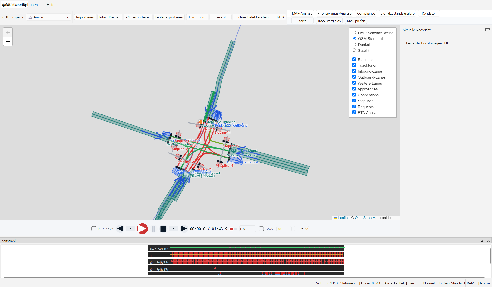

### 2. Schnellbefehl-Palette

### 3. Statistik-Dashboard

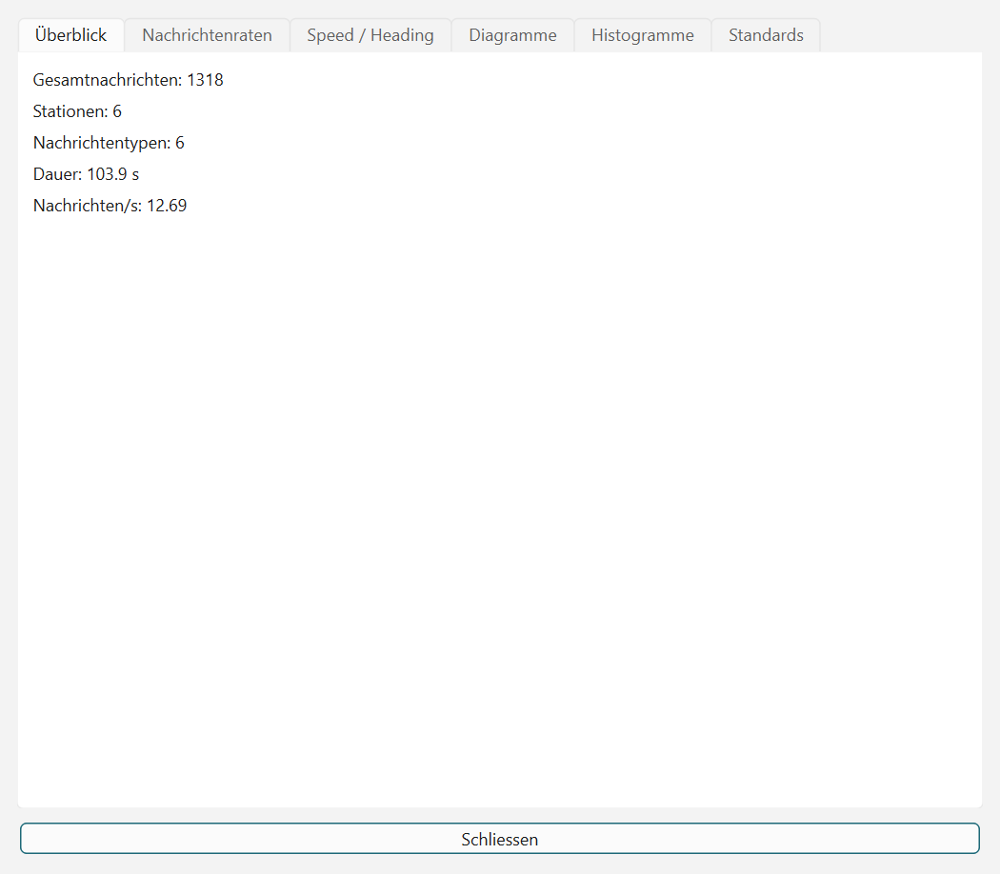

### 4. ETA Analyse

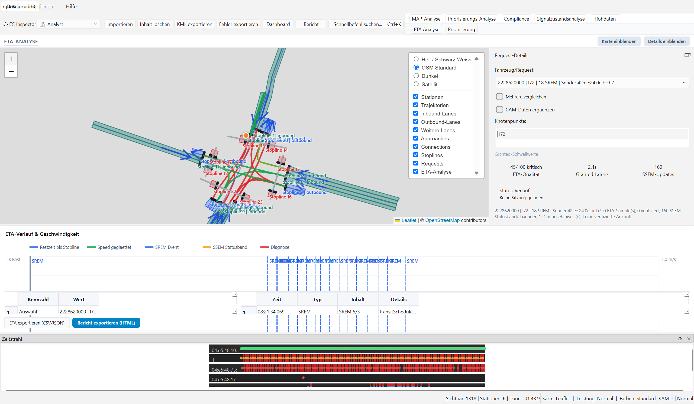

### 5. Priorisierungsfehler

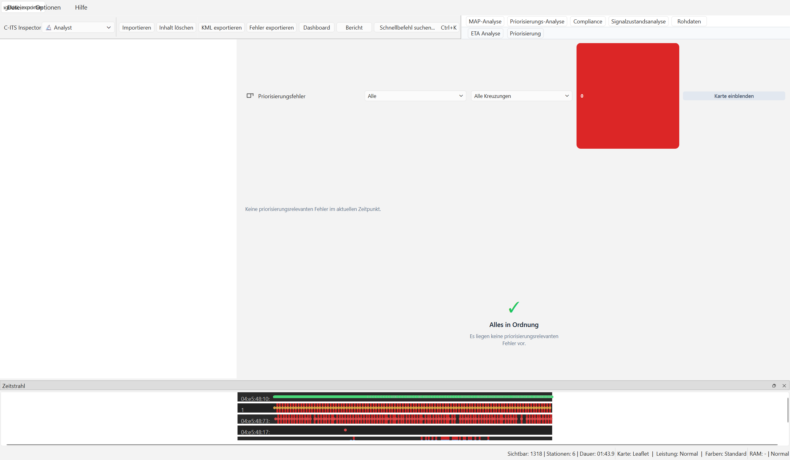

### 6. Rohdaten und Detail-Inspektor

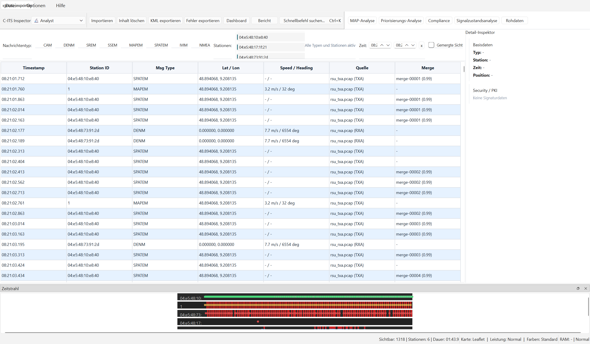

### 7. MAP/SPAT-Pruefung

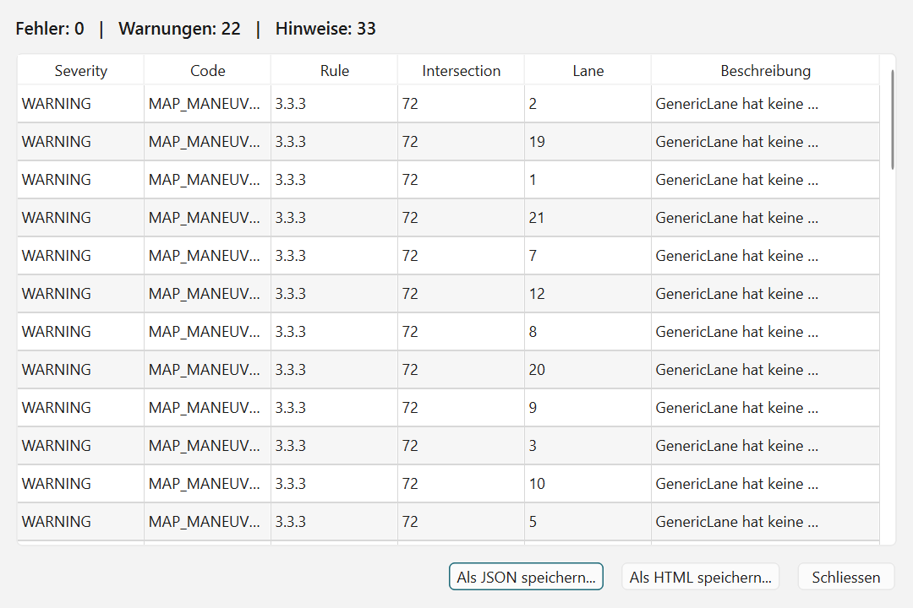

## Karten-Ausschnitte fuer Analyse

Diese Ausschnitte sind fuer Praesentationen besser geeignet als Vollfenster-Screenshots, weil sie die fachliche Karteninformation ohne grosse leere UI-Bereiche zeigen.

### 8. PCAP-Daten: Trajektorien und Infrastruktur

Beispieldaten: `testfiles/rxa_22082025.pcap` und `testfiles/txa_22082025.pcap`.  
Kartenzentrum: MAPEM-Knotenpunkt `52.427970, 13.526802`, Zoomstufe `19`.

Sichtbar sind Fahrzeug-/Stationspunkte, Trajektorien, Fahrspuren, Stoplines, Requests und MAP/SPAT-Layer. Der Ausschnitt eignet sich, um die gemeinsame Analyse von PCAP-Bewegungsdaten und Infrastrukturinformationen zu zeigen.

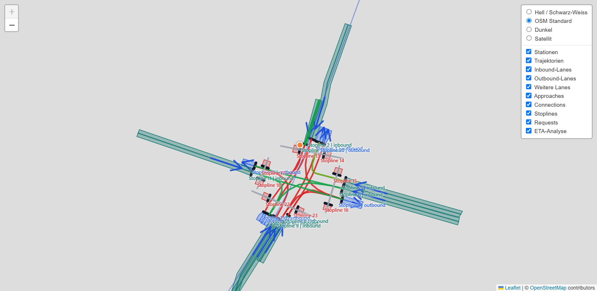

### 9. MAP-XML-Daten: Kreuzungsgeometrie

Beispieldaten: `testfiles/Landau_2009886_V06_R1.xml`.  
Kartenzentrum: MAP-XML-Knotenpunkt `49.2034845, 8.1241752`, Zoomstufe `19`.

Sichtbar sind die aus MAP-XML abgeleiteten Fahrspuren, Approaches, Connections und Stoplines. Der Ausschnitt eignet sich, um die Analyse einer Kreuzung ohne PCAP-Bewegungsdaten zu zeigen.

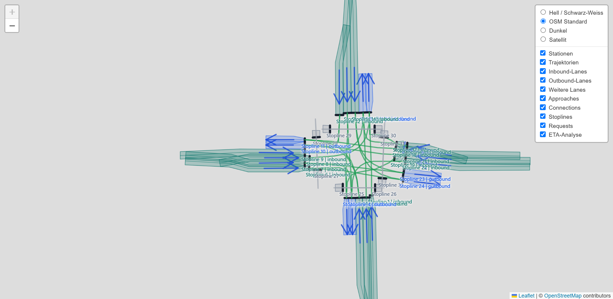

### 10. Wireshark-Start-Hinweis

Hinweisdialog beim ersten App-Start zur Beschleunigung des PCAP-Parsings.

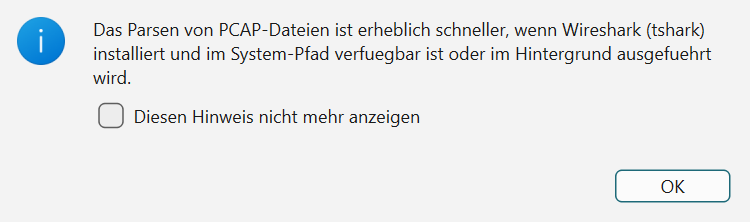

### 11. SPAT-Vorhersagequalität

Workspace Prognose-Analyse zur systematischen Bewertung der Phasenprognose-Qualität (LikelyTime) mit interaktiven Matplotlib-Diagrammen und Vollständigkeitsanalyse.

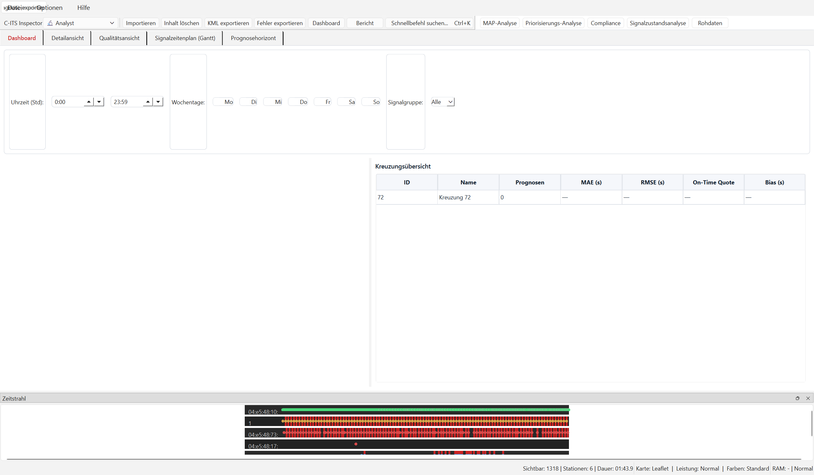

### 12. SPAT-Signalzeitenplan (Gantt)

Visualisierung der Signalzustandsübergänge (Rot, Gelb, Grün) über die Zeitachse hinweg. Die Sterne markieren den exakten Zeitpunkt von Priorisierungsanfragen (SRMs), was die Korrelation zwischen Ampelschaltung und ÖPNV-Steuerung erleichtert.

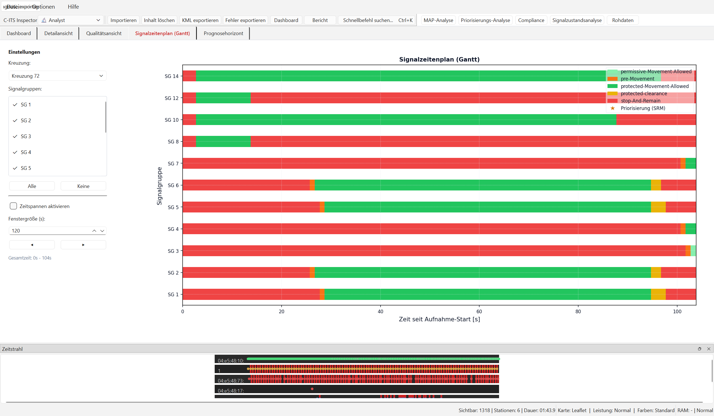

### 13. SPAT-Prognosehorizont

Diese Ansicht zeigt die zeitliche Stabilität von Signalwechsel-Vorhersagen und ab welcher Restzeit stabile Prognosen vorliegen. Sie eignet sich hervorragend zur Qualitätsbewertung von SPAT-Sendern.

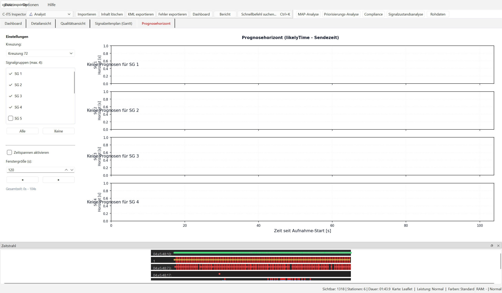

## Lizenzierung und Demo-Modus

Der C-ITS Inspector v2.0 erzwingt offline-fähige Lizenzen. Ohne Lizenzdatei schränkt die Anwendung die Funktionen zum Schutz des geistigen Eigentums drastisch ein.

### 14. Lizenzdialog im Demo-Modus

Wird die Anwendung unlizenziert gestartet, erscheint ein roter Warnbereich. Hier kann die Hardware-ID kopiert werden, welche für die Lizenzgenerierung benötigt wird.

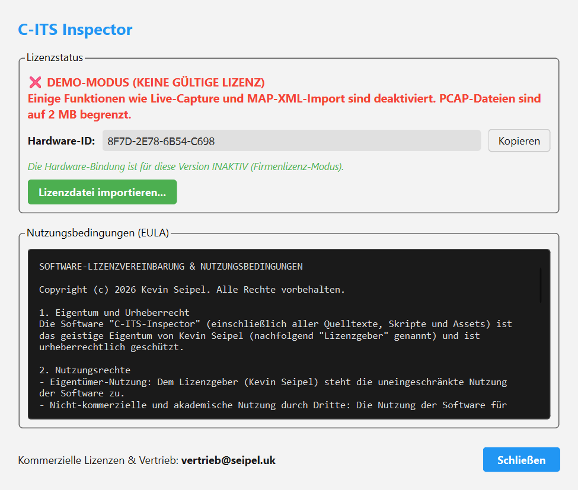

### 15. Lizenzdialog in der Vollversion

Nach erfolgreichem Import einer gültigen kommerziellen Lizenzdatei wird das Banner grün. Das Fenster zeigt den Namen des Lizenznehmers und das Ablaufdatum an. Alle Programmfunktionen sind voll freigeschaltet.

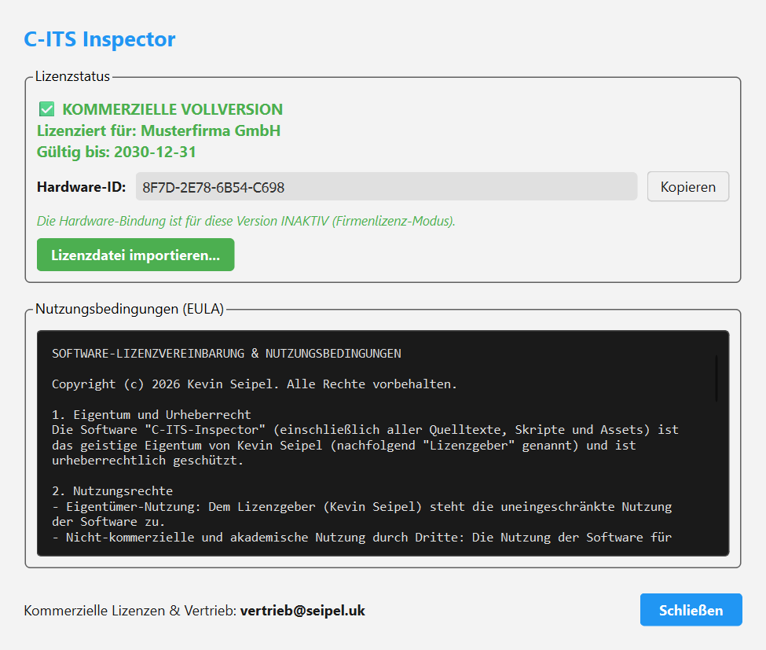
